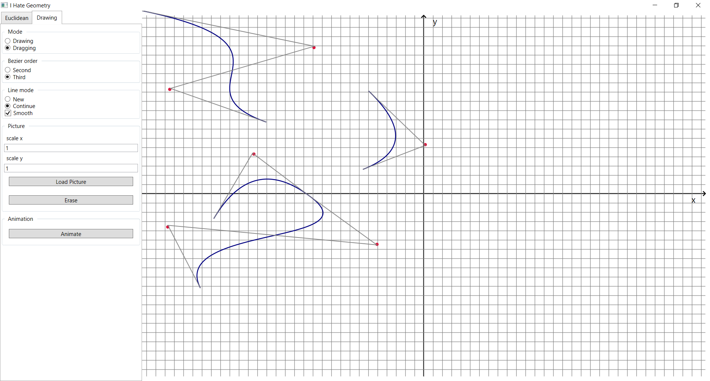
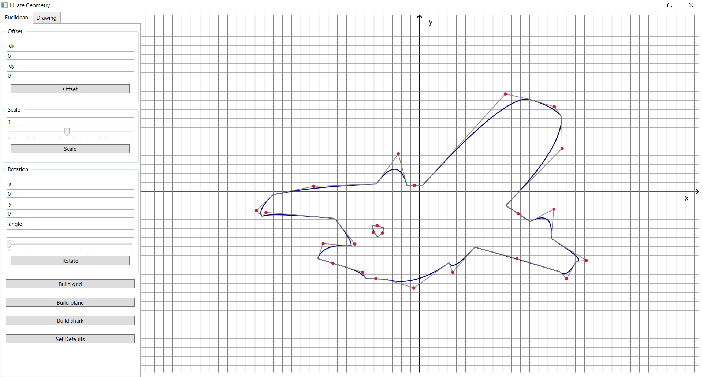
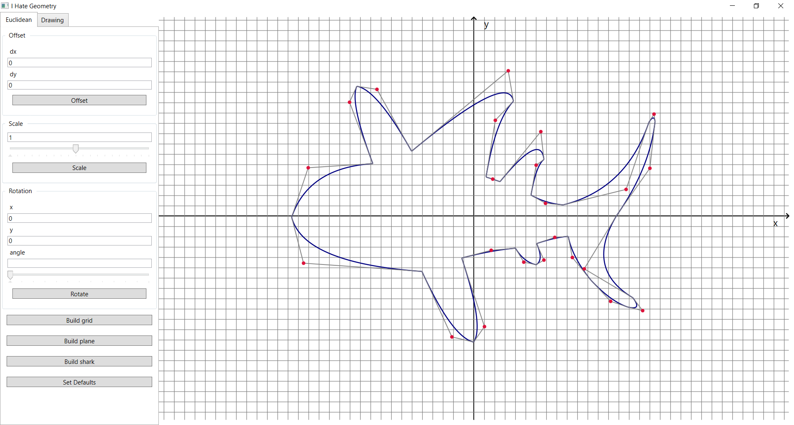
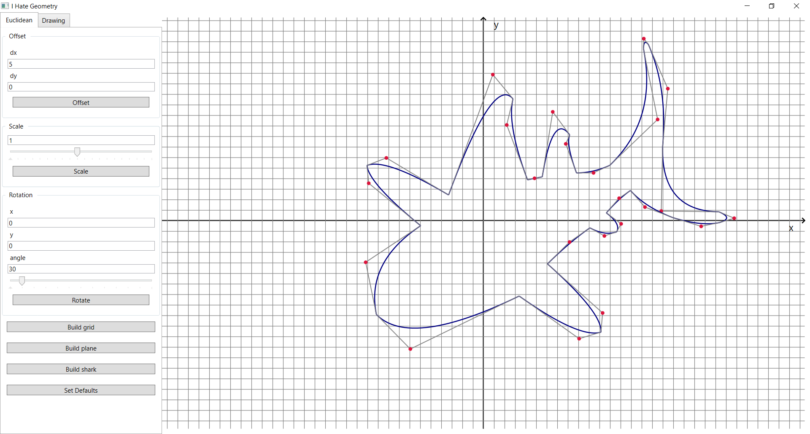
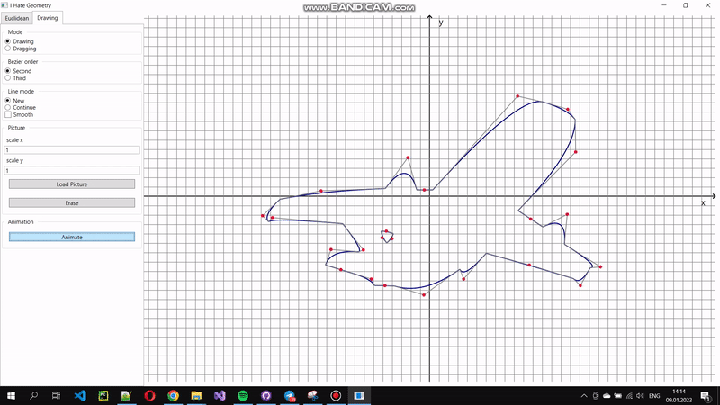

# Bezier curve
The project is dedicated to modeling a curvilinear contour with first-order smoothness by one of the following methods:
1. Bezier curves of the second order
2. Bezier curves of the third order

The created system is able to perform the following actions:
- Contour construction in dialog mode with visualization of characteristic polygons of curves.
- Automatic and manual selection of parameters that are required for contour construction.
- Animated curve change as a result of automatic selection of parameters.
- For dynamics, implemented Euclidean transformations.
- Animated transition of one curvilinear contour to another.

## Drawing
The system allows you to perform in two modes:
- Drawing mode for building youur own contour using Bezier curves of the second and third order, including smooth curves.
- Dragging mode for moving points of the curves.

There are two presets for drawing & dragging functionality demonstration:
- Plane picture
- Shark picture

Also it could be mentioned that project allow you to insert an image for better drawing experience.

## Transforming
You are free to use rotation, scaling and offset transformations for built pictures. 
Also there is able an animation transformation demo example.

## Examples

Drawing curves

Plane pircture

Shark picture

Transformations

Animation
